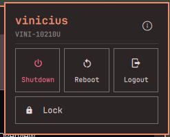

# omarchy-plugin-power

A power menu bar-widget for the [Omarchy](https://omarchy.org/) shell. Adds
a power icon to the bar; clicking it opens a popup with your user and host
info, every power action of the native Omarchy System menu, and the
idle/sleep switches.

## What it does

Every action calls the same native `omarchy-*` commands the built-in
Omarchy menu uses, so you get the same confirmation OSDs and behavior:

- **Shutdown**, **Reboot**, **Logout** — side by side at the top
- **Lock** — full-width button below them
- **Suspend**, **Hibernate**, **Screensaver** — same visibility rules as
  the native menu: Suspend is hidden when it's disabled in Omarchy, and
  Hibernate only shows up when the system supports it
- **Stay Awake** — disable idle lock and screensaver (`omarchy-toggle-idle`)
- **Screensaver** — turn the idle screensaver on or off
  (`omarchy-toggle-screensaver`)
- An info icon next to your username opens the native "About this
  system" window (`omarchy-launch-about`)

## Preview



## Usage

Click the power icon in the bar to open the menu described above.

## Install

```bash
omarchy plugin add https://github.com/vinicgobbi/omarchy-plugin-power.git --enable
```

When enabling, pick which bar section (left/center/right) you want the
power icon in.

## Update

```bash
omarchy plugin update vinicgobbi.power
```

## Uninstall

```bash
omarchy plugin remove vinicgobbi.power
```

## Contributing

See [CONTRIBUTING.md](CONTRIBUTING.md) for local setup, the plugin's
file structure, and the commit/release process.

## License

[MIT](LICENSE)
